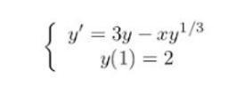
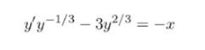
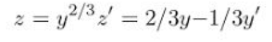
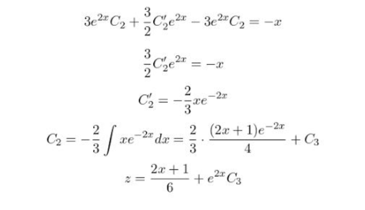
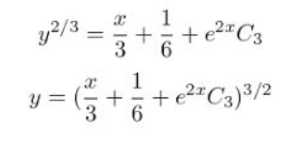

# Differential Equations: Computational Practicum

## Report:
Name: Mohammad Rami Husami
Group: B20-04

## Exact Solution:

This is the Bernoulli equation, let's solve it.

First we should divide both parts by `y^(2/3)`

We get

then5 make the following substitution

We get

Equation (1) is a first-order non-homogeneous linear ordinary differential equation.

First we need to solve the complementary equation

Substitute to Equation (1)

Back substitution

So, let's find `C3`

### Answer:

## Results

### Solutions charts

Chart of solution and approximate values.

We can notice that the Runge-Kutta methods calculates the most approximate values, the worst approximation is done by the Euler method.

### LTE charts

Also we can see that the Runge-Kutta methods has the smallest error and the Euler has larger errors.

### Global Errors chart

We can see here that if we increase the steps, the value of GTE decreases.

### UML Diagram
