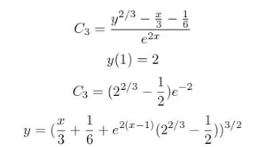
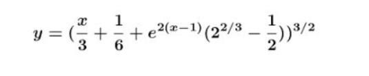
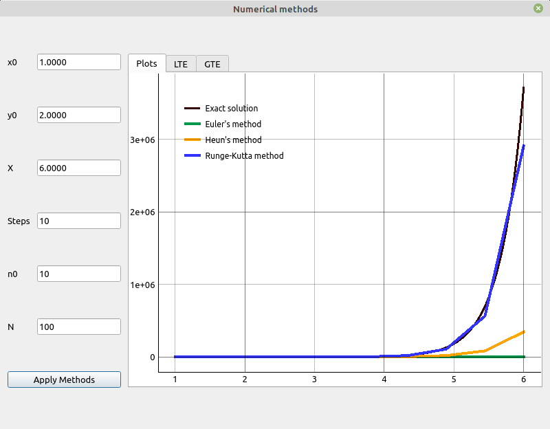
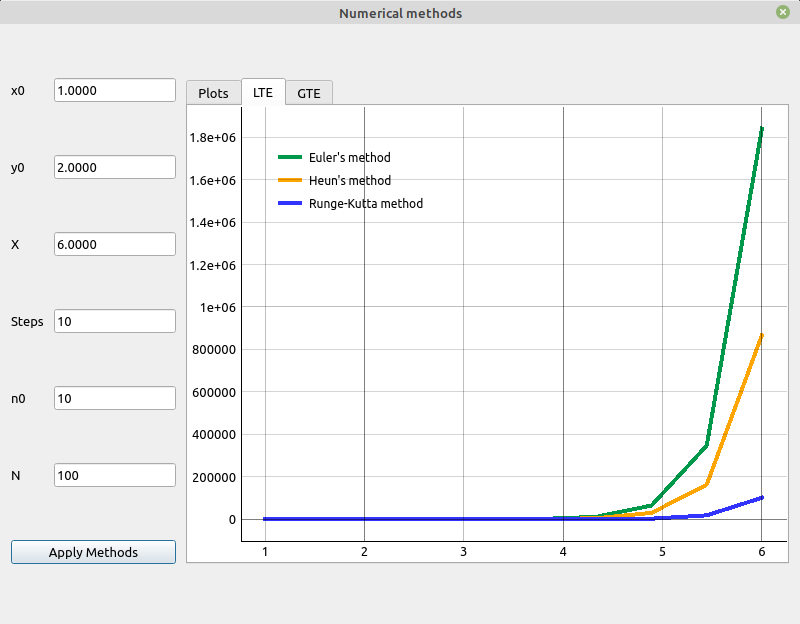
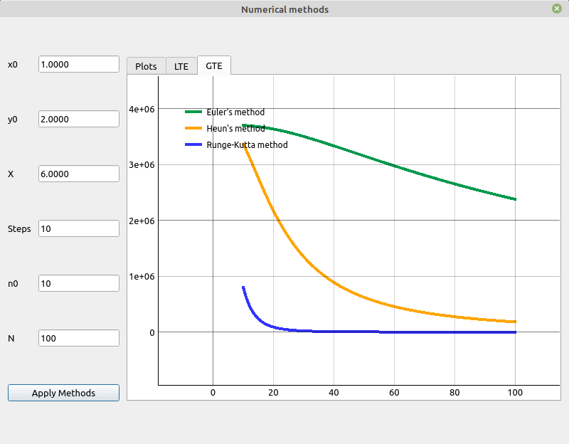
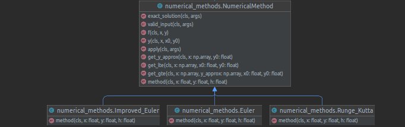

# Differential Equations: Computational Practicum

## Report:
Name: Mohammad Rami Husami

Group: B20-04

## Exact Solution:

$$\begin{cases}y' = 3y - xy^{\frac {1} {3} }\\y(1) = 2\end{cases}$$

$$y' - 3y = xy^{\frac {1} {3}}$$

This is the Bernoulli equation, let's solve it.

First we should divide both parts by $y^{\frac{2}{3}}$

We get

$$ y' y^{-\frac{1} {3}} - 3y^{\frac {2}{3}} = -x $$

then make the following substitution

$$ z = y ^ {\frac{2}{3}} $$

$$ z'= \frac{2}{3}y - \frac{1}{3}y'$$

We get

$$\frac{3}{2}z' - 3z = -x \tag{1} $$

$Equation(1)$ is a first-order non-homogeneous linear ordinary differential equation.

First we need to solve the complementary equation

$$\frac{3}{2}z' - 3z = 0$$

$$z' = 2z$$

$$\int \frac{dz}{z} = 2\int dx$$

$$e^{ln|z|} = e ^ {2x + C_1}$$

$$z = e^{2x}C_2$$

$$z' = 2e^{2x}C_2 + C'_2 e^{2x}$$

Substitute to $Equation(1)$

$$3e^{2x}C_2 + \frac{3}{2}C'_2 e^{2x} - 3e^{2x}C_2 = -x$$

$$\frac{3}{2}C'_2 e^{2x} = -x$$

$$C'_2 = -\frac{2}{3}xe^{-2x}$$

$$C_2 = -\frac{2}{3} \int xe^{-2x}dx = \frac{2}{3} . \frac{(2x + 1)e^{-2x}}{4} + C_3$$

$$z = \frac{2x + 1}{6} + e^{2x}C_3$$

Back substitution

$$y^{\frac{2}{3}} = \frac{x}{3} + \frac{1}{6} + e^{2x}C_3$$

$$y = (\frac{x}{3} + \frac{1}{6} + e^{2x}C_3)^{\frac{3}{2}}$$

So, let's find $C_3$
$$C_3 = \frac{y^{\frac{2}{3}} - \frac{x}{3} - \frac{1}{6}}{e^{2x}}$$

$$y(1) = 2$$

$$C_3 = (2^{\frac{2}{3}} - \frac{1}{2})e^{-2}$$

$$y = (\frac{x}{3} + \frac{1}{6} + e^{2(x-1)}(2^{\frac{2}{3}} - \frac{1}{2}))^{\frac{3}{2}}$$

<!--  -->

### Answer:
$$y = (\frac{x}{3} + \frac{1}{6} + e^{2(x-1)}(2^{\frac{2}{3}} - \frac{1}{2}))^{\frac{3}{2}}$$

<!--  -->

## Results

### Solutions charts

Chart of solution and approximate values.

We can notice that the Runge-Kutta methods calculates the most approximate values, the worst approximation is done by the Euler method.

### LTE charts

Also we can see that the Runge-Kutta methods has the smallest error and the Euler has larger errors.

### Global Errors chart

We can see here that if we increase the steps, the value of GTE decreases.

### UML Diagram
